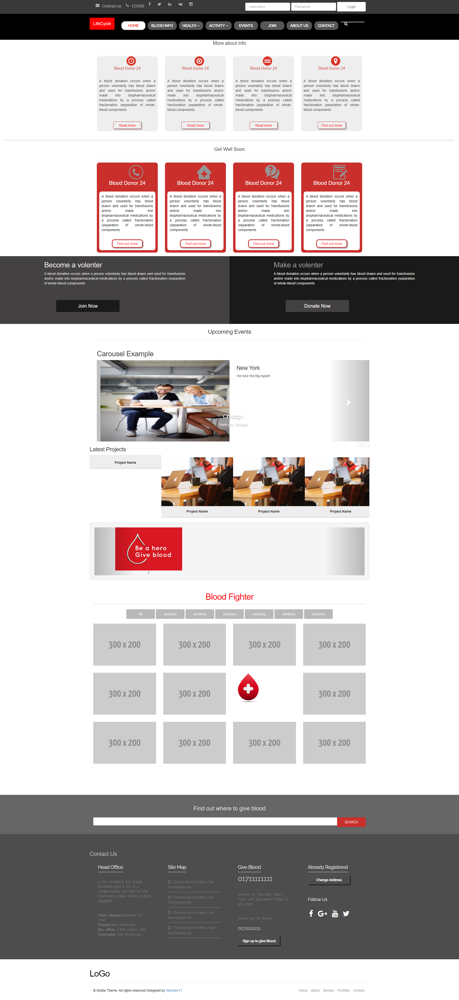

# Blood Donation Website Template

This is a responsive HTML template for a blood donation website. It is designed to provide information about blood donation, encourage people to donate, and facilitate the process of finding nearby blood donation centers.

## Features

- Responsive design: The template is optimized to work on various devices and screen sizes.
- Informative sections: The template includes sections for displaying information about blood donation, the importance of donating, eligibility criteria, and frequently asked questions.
- Call-to-action: The template features prominent call-to-action buttons and sections to encourage visitors to donate blood.
- Donation center locator: The template provides a feature to search for nearby blood donation centers based on the user's location.
- Contact form: Visitors can use the contact form to get in touch with the blood donation organization for inquiries or appointment scheduling.

## Demo 

## Usage

To use this template, follow these steps:

1.  Clone the repository or download the ZIP file.

    `git clone https://github.com/jmrashed/blood-donation-template.git`

2.  Open the `index.html` file in a web browser to see the template in action.
3.  Customize the content of the template according to your needs. Update the text, images, and links to match your blood donation organization's information.
4.  If you want to use the donation center locator feature, you'll need to implement the backend functionality to retrieve and display the nearby blood donation centers based on the user's location. You can use a combination of geolocation APIs and a database of blood donation centers for this purpose.
5.  If required, modify the styles in the CSS files (`styles.css`, `responsive.css`) to match your branding or design preferences.
6.  Deploy the template to your web server or hosting provider to make it accessible to visitors.

## Customization

The template is designed to be easily customizable. Here are some customization options:

- Logo: Replace the logo image (`images/logo.png`) with your own blood donation organization's logo.
- Colors: Modify the color scheme by updating the CSS styles in `styles.css` and `responsive.css`.
- Images: Replace the images in the `images` folder with your own images or use different stock images that align with the content.
- Content: Update the text and information in the HTML files (`index.html`, `about.html`, `eligibility.html`, `faq.html`, `contact.html`) to provide relevant and accurate information about your blood donation organization.
- Navigation: Modify the navigation menu in the `index.html` file to add or remove navigation links as per your requirements.

## Credits

This template utilizes the following resources:

- [Bootstrap](https://getbootstrap.com/)
- [Font Awesome](https://fontawesome.com/)

Please make sure to review their respective licenses and terms of use when using the template.

## License

This template is released under the [MIT License](https://chat.openai.com/LICENSE). You are free to modify and use the template for your blood donation website according to the terms of the license.

## Contact

If you have any questions or need further assistance, feel free to contact the template creator at [jmrashed@gmail.com](mailto:jmrashed@gmail.com).
